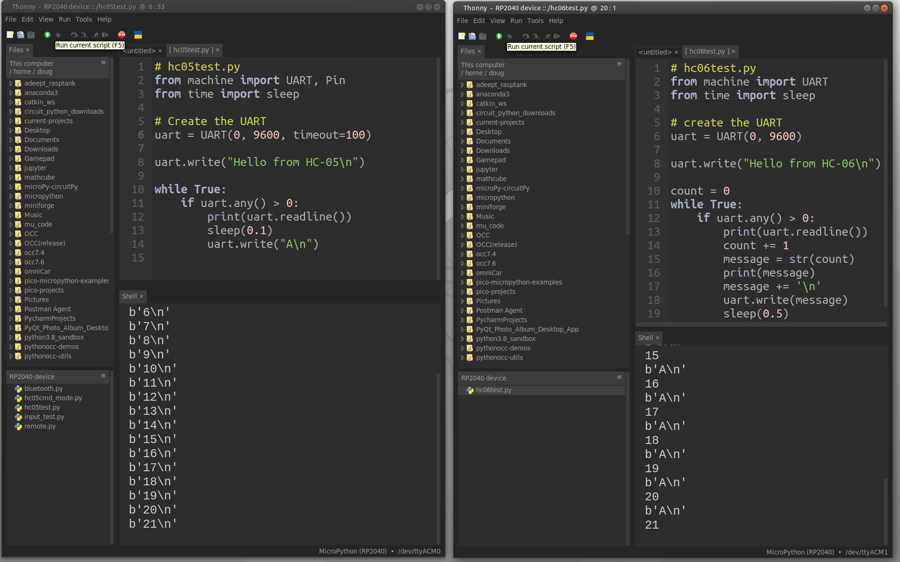
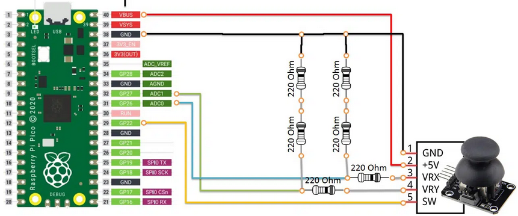
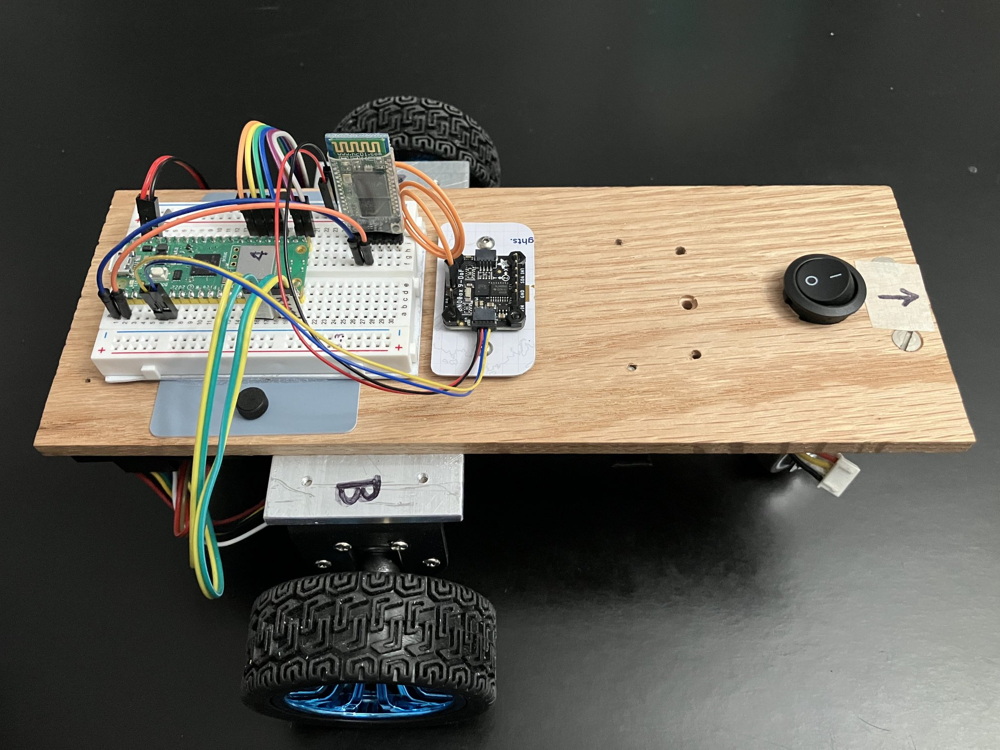
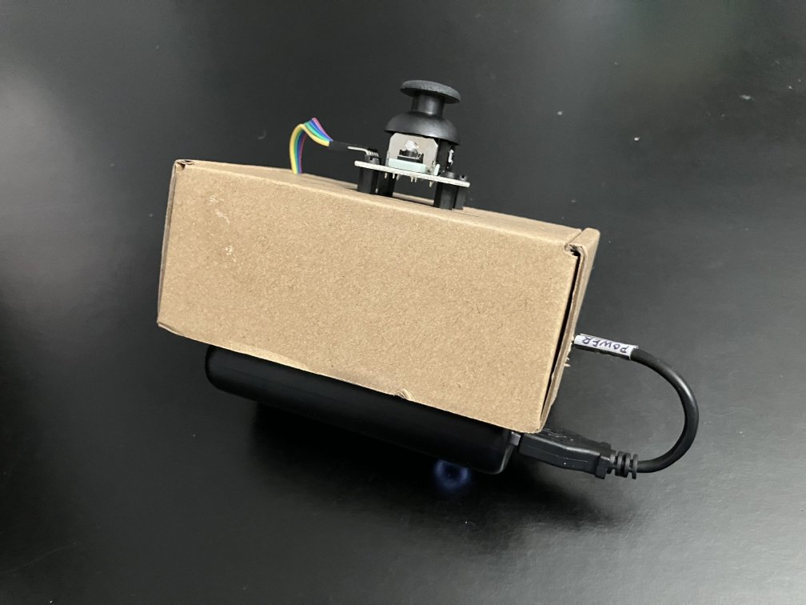
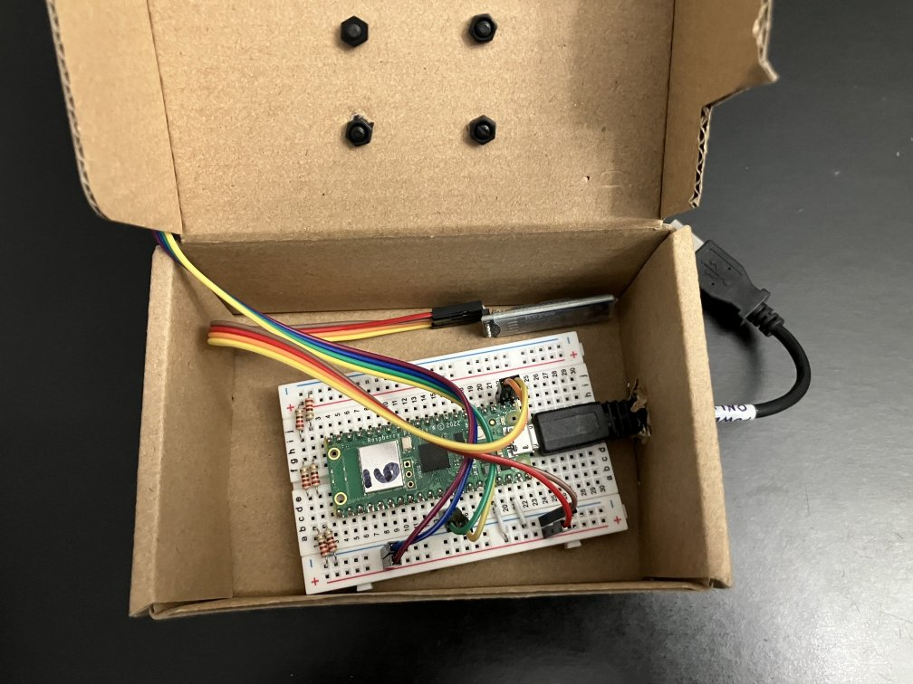
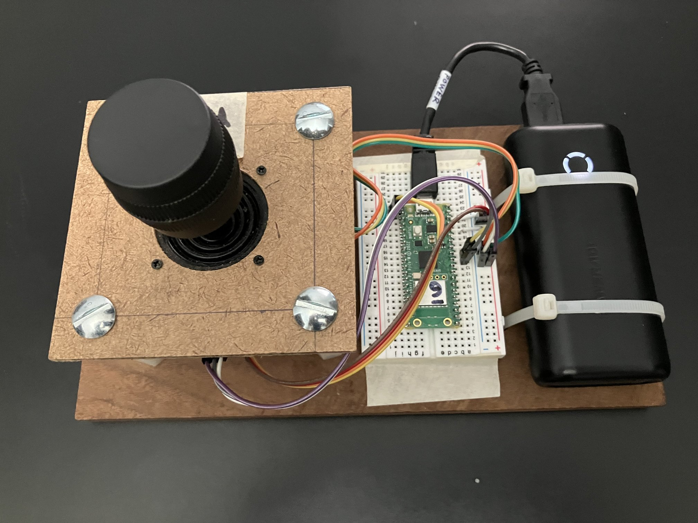
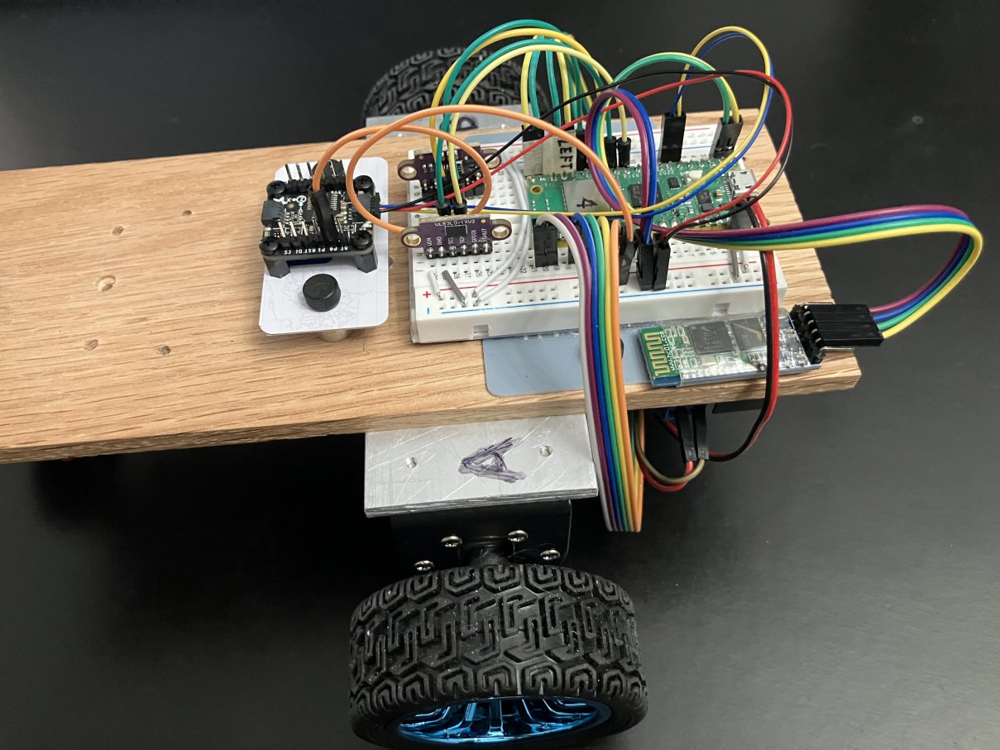
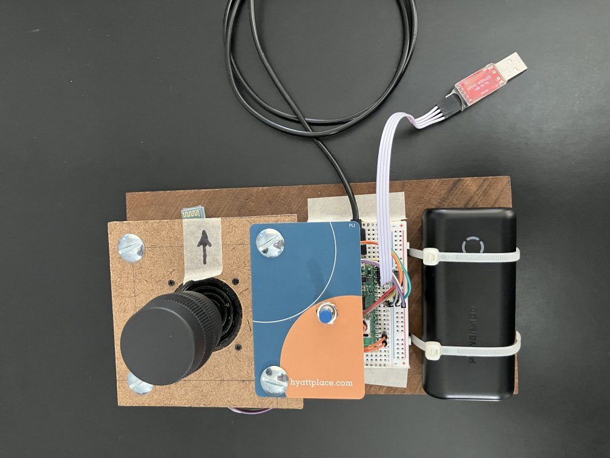

# PicoBot TeleOperation using a pair of HC-05 / HC-06 BT modules.

* I did something like this with arduinos for [driving the Omni-wheel car in teleOp mode](https://github.com/dblanding/teleOpOmniCar).
    * The way it worked was to send motor speed values to the robot as comma separted (string) values
    * The robot would receive these string values, convert them to numerical values, then sendback a single character to acknowledge.
    * Once the acknowledgement message was received back, another comma separted string is sent.

* The goal here is to do the same thing, except using Picos instead of Arduinos
    * The driver station controller would use a 2 axis joystick (instead of 3)
    * The comma separated values would represent x and y joystick position (instead of 4 motor speeds)
        * Conversion from joystick value to motor speed would be done on the robot
* Here are the two Thonny sessions with both Picos communicating with each other:

## Looks good! Now let's hook up a joystick and send 2 integer values representing joystick x, y position.

* Here's an article showing how to hook up the joystick: [Analog Joystick With Raspberry Pi Pico and MicroPython](https://peppe8o.com/analog-joystick-with-raspberry-pi-pico-and-micropython/)
* Excellent article, except for one thing... It shows the joystick hooked up to 5V, then uses 2 voltage dividers to bring the wiper voltage down to 3.3V. This introduces huge non-linearity because the impedance of the divider network is way too low for the 10K pots of the joystick.
    * Much better to hook the joystick up to 3.3V and then hook the pot wipers up directly to the A0 and A1 pins. No need for the 220 ohm resistors.

### Here's the robot with HC-05 BT module and BNO08x IMU (not being used):

### And here's the controller: A cheap 2-axis joystick attached to the top of the box it came in:

## Next, add Odometry: Use wheel encoder data to calculate current pose
* Starting from its **Home** position at pose = (0, 0, 0)
* Robot calculates its new updated pose every time it receives a driving command from the controller.
    * As acknowledgement of receipt of joystick values, robot returns its current pose (x, y, theta) to the controller.
    * Controller receives current pose and sends another pair of joystick values

## Use a better joystick
* The small button joystick is actually kind of crappy.
    * Electrically, it goes from 0 to full resistance within a small range of physical motion.
    * This makes it kind of annoying to use.
* I replaced it with a more deluxe joystick that I had on hand from the [earlier project](https://github.com/dblanding/teleOpOmniCar).
    * The electrical range of this joystick is much better aligned with the full range of physical motion.
    * It really is **a joy to use**. (Get it? ;-) )

## Add Left & Right distance sensors and IMU
* Two VL53L0x distance sensors added, allowing PicoBot to *see* (up to ~1 meter) left and right
    * Left & Right distance values appended to pose message sent to controller
* BNO08x IMU yaw data used to provide a "second opinion" about robot's current heading
    * Yaw value (degrees) is converted to radians and appended to data message
* Controller saves data to file

## How does it all work, in practice?
* In operation, the joystick enables the robot to be driven around a room while collecting the data sent back from the robot. Once the run is complete, the driver pushes a button on the controller, which causes the data to be saved to a log file whose name is timestamped.
* In order to get the Pico's RTC set correctly to localtime, it needs to be hooked up to Thonny.
* The problem with the timestamp is that when the pico is battery powered, it sets the date and time to midnight on 2021/01/01.
* So, how to get the correct date and time from Thonny while not having to be tethered to the laptop when driving the robot around the room?

## Dual-power
* A USB to TTL adapter allows the +5V from the power cell to be connected to the Pico's Vsys Pin

* Here is the sequence:
    1. Connect the Pico's Vsys pin (and ground) to the power cell
    2. Connect the Pico to the laptop using the USB cable, start Thonny then start main.py
    3. Unplug the USB cable from the laptop - Now the controller is free of the laptop with its RTC correctly set to localtime and with its main.py running...
    4. Drive the robot around the room
        * When the run is complete, push the blue button save the datafile to a timestamped log.
        * The controller can be turned off by unplugging the power cell.
    5. The data can be retrieved any time by connecting the controller to Thonny.

